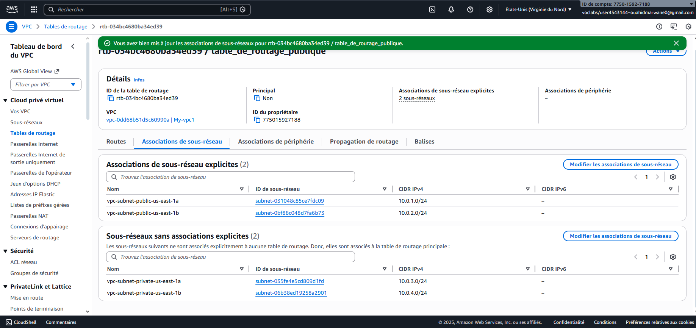
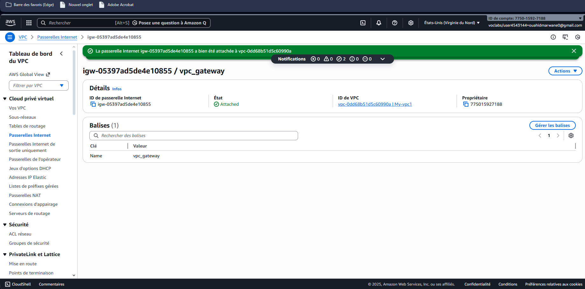
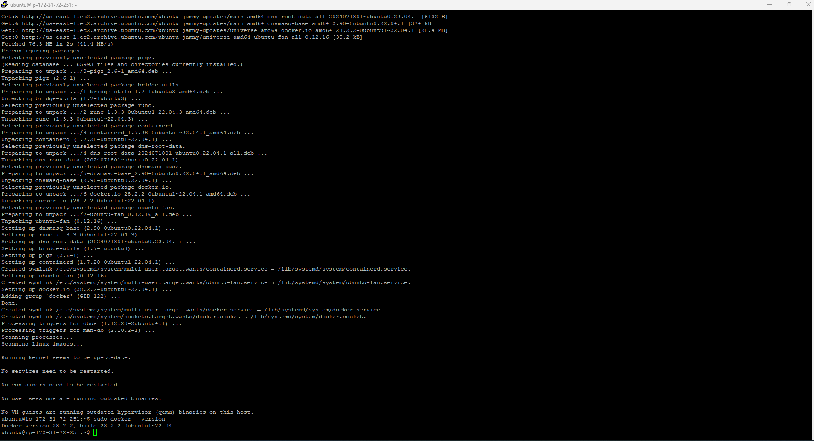
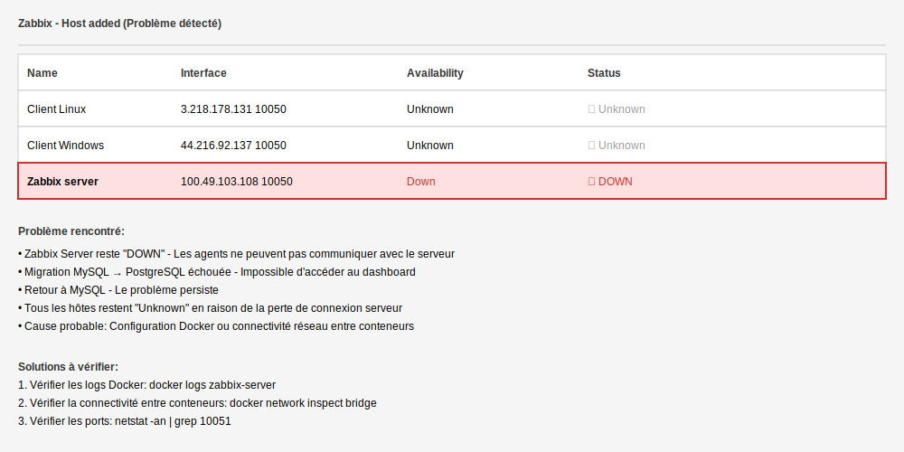

<div align="center">
   
   </div>

<div align="center">

# Mise en place d'une infrastructure de supervision avec Zabbix sur AWS

**Réalisée par :** Marwane OUAHID

**Encadrée par :** Prof. Azeddine KHIAT

**Année :** 2025/2026

---


</div>

---

## 1. Introduction

Dans le cadre de ce projet, l'objectif est de mettre en place une solution de supervision centralisée permettant de surveiller des machines Linux et Windows à l'aide de Zabbix, déployé sur une infrastructure cloud AWS.

La supervision permet de :
- Suivre l'état des systèmes
- Détecter les anomalies
- Assurer la disponibilité des services

---

## 2. Objectifs du projet

Les objectifs principaux sont :

1. **Déployer un serveur Zabbix** sur une instance EC2 Ubuntu
2. **Superviser :**
   - Un client Linux
   - Un client Windows
3. **Utiliser Zabbix Agent** pour la collecte des métriques
4. **Mettre en place la communication réseau** entre les agents et le serveur
5. **Accéder à l'interface web de Zabbix**
6. **Vérifier la remontée des données** de supervision

---

## 3. Architecture générale de l'infrastructure

L'architecture repose sur :

- **Un VPC AWS** (My-vpc1)
- **Deux sous-réseaux publics** (us-east-1a et us-east-1b)
- **Deux sous-réseaux privés** (us-east-1a et us-east-1b)
- **Une passerelle Internet** (Internet Gateway)
- **Des tables de routage séparées** (publique / privée)
- **Instances EC2 Linux et Windows**
- **Zabbix Server conteneurisé avec Docker**

### Figure 1 : Mapping des ressources VPC


*Figure 1 : VPC, sous-réseaux, tables de routage*

---

## 4. Configuration du réseau AWS (VPC)

### 4.1 Création du VPC

Une VPC nommée **My-vpc1** a été créée avec un CIDR privé.

### 4.2 Sous-réseaux

Deux zones de disponibilité ont été utilisées :
- **us-east-1a**
- **us-east-1b**

Chaque zone contient :
- 1 sous-réseau public
- 1 sous-réseau privé

### Figure 2 : Liste des sous-réseaux



*Figure 2 : Sous-réseaux publics et privés avec CIDR*

### 4.3 Passerelle Internet (Internet Gateway)

Une Internet Gateway a été créée et attachée au VPC afin de permettre l'accès Internet aux sous-réseaux publics.

### Figure 3 : Internet Gateway



*Figure 3 : Passerelle Internet attachée au VPC*

### 4.4 Tables de routage

**Table de routage publique :**
- Route : 0.0.0.0/0 → Internet Gateway
- Associée aux sous-réseaux publics

**Table de routage privée :**
- Routes internes uniquement
- Associée aux sous-réseaux privés

---

## 5. Environnement utilisé

- **Cloud :** Amazon Web Services (AWS)
- **Région AWS :** us-east-1
- **Serveur Zabbix :**
  - Instance EC2
  - OS : Ubuntu Server
  - Déploiement via Docker & Docker Compose
- **Clients supervisés :**
  - Linux (Ubuntu)
  - Windows 10/11

### Figure 4 : Instances EC2


*Figure 4 : Les instances*

### Figure 5 : Groupe de sécurité Zabbix server


*Figure 5 : Groupe de sécurité Zabbix server*

### Figure 6 : Groupe de sécurité Client Linux


*Figure 6 : Groupe de sécurité Client Linux*

### Figure 7 : Groupe de sécurité Client Windows


*Figure 7 : Groupe de sécurité Client Windows*

> **Note :** ICMP a été ajouté dans les groupes de sécurité pour faire des pings afin d'assurer que les instances communiquent entre eux dans le même VPC.

---

## 6. Déploiement de Zabbix Server avec Docker

### 6.1 Installation de Docker

Docker a été installé sur l'instance Linux destinée au serveur Zabbix afin de faciliter le déploiement.

### Figure 8 : Installation de Docker



*Figure 8 : Installation de Docker (docker --version)*

### 6.2 Fichier docker-compose.yml

Zabbix a été déployé à l'aide de Docker Compose avec :
- zabbix-server-mysql
- zabbix-web-nginx-mysql
- mysql

### Figure 9 : Contenu du fichier docker-compose.yml


*Figure 9 : Contenu du fichier docker-compose.yml*

### 6.3 Lancement des conteneurs

Les services ont été démarrés avec la commande :
```bash
sudo docker-compose up -d
```

### Figure 10 : Résultat de docker ps


*Figure 10 : Résultat de docker ps montrant les conteneurs actifs*

---

## 7. Accès à l'interface Web Zabbix

L'interface Zabbix est accessible via un navigateur à l'adresse :
```
http://100.49.103.108:80
```

### Figure 11 : Interface Zabbix


*Figure 11 : Interface Zabbix*

---

## 8. Installation et configuration des agents Zabbix

### 8.1 Client Linux

**Installation de l'agent Zabbix :**
```bash
sudo apt install -y zabbix-agent
```

**Configuration du fichier `zabbix_agentd.conf`**

Paramètres clés :
- `Server` : Adresse IP du serveur Zabbix
- `ServerActive` : Adresse IP pour les checks actifs
- `Hostname` : Nom de l'hôte

### Figure 12 : Service agent actif


*Figure 12 : Service actif (systemctl status zabbix-agent)*

### 8.2 Client Windows

**Installation de Zabbix Agent (64-bit)**
- Configuration automatique lors de l'installation

**Paramètres configurés :**
- Server : Adresse IP du serveur Zabbix
- ServerActive : Adresse IP pour les checks actifs
- Hostname : client-windows

### Figure 13 : Connexion RDP


*Figure 13 : Connexion RDP au client Windows*

### Figure 14 : Insertion de l'IP du serveur Zabbix


*Figure 14 : Configuration IP du serveur Zabbix sur Client Windows*

je l'ai changer apres l'activation du IP elastique:100.49.103.108


---

## 9. Interface Zabbix - Création des hôtes

### Figure 15 : Hôtes Zabbix


*Figure 15 : Interface de création des hôtes dans Zabbix*

Cette capture d'écran montre l'interface utilisée pour ajouter un nouvel hôte dans Zabbix. Les options permettent de spécifier le nom de l'hôte, l'interface de communication avec l'agent Zabbix, et les modèles à appliquer.

---

## 10. Adresses IP de supervision

| Composant | Adresse IP |
|---|---|
| **Zabbix Server** | 100.49.103.108 |
| **Client Linux** | 3.218.178.131 |
| **Client Windows** | 44.216.92.137 |

---

## 11. Difficultés rencontrées et solutions

### 11.1 Zabbix Server "DOWN" et migration MySQL → PostgreSQL

**Symptômes rencontrés :**
- Zabbix Server reste en statut **"DOWN"**
- Tous les agents restent en statut **"Unknown"**
- Impossible de collecter les données des clients Linux et Windows

**Contexte :**
Une tentative de migration de la base de données MySQL vers PostgreSQL a été effectuée, mais a échoué avec perte d'accès au dashboard Zabbix.

**Causes probables :**
- Problème de connectivité entre les conteneurs Docker
- Configuration incorrecte du docker-compose après migration
- Port **10051** non accessible ou mal configuré
- Service Zabbix Server crash ou non démarré correctement

**Solutions à appliquer :**

1. Vérifier les logs du conteneur serveur :
```bash
docker logs zabbix-server
docker logs zabbix-mysql
```

2. Vérifier la connectivité entre conteneurs :
```bash
docker network inspect bridge
```

3. Vérifier le statut des ports :
```bash
netstat -an | grep 10051
```

4. Redémarrer le stack complet :
```bash
docker compose down
docker compose up -d
```

5. Attendre quelques minutes que le serveur soit complètement initialisé avant d'ajouter les hôtes.

### Figure 16 : Zabbix Server DOWN



*Figure 16 : Statut des hôtes avec Zabbix Server DOWN - Tous les agents restent Unknown*

### 11.2 Ports bloqués (10050/10051)

**Symptômes typiques :**
- ZBX reste gris/rouge
- Données absentes dans « Latest data »

**Causes probables :**
- Règles Security Group incomplètes
- Firewall local (UFW Linux, Windows Firewall)
- Mauvaise IP renseignée dans `Server` / `ServerActive`

**Solutions appliquées :**
- Vérifier les règles entrantes : **TCP/10050** (agents) et **TCP/10051** (serveur)
- Restreindre au besoin, mais s'assurer que le flux est autorisé entre instances

### 11.3 Docker non démarré après arrêt du Lab

**Contexte Learner Lab :** Le Lab peut s'arrêter automatiquement. Après redémarrage de l'instance, il est possible que les services ne soient pas immédiatement disponibles.

**Solutions appliquées :**
- Activer Docker au boot :
```bash
sudo systemctl enable --now docker
```

- Relancer le stack Zabbix :
```bash
docker compose up -d
```

- Les conteneurs sont configurés avec `restart: unless-stopped` pour améliorer la résilience après reboot.

---

## 12. Conclusion

Ce projet a permis de :
- Concevoir une architecture réseau AWS avec VPC et sous-réseaux
- Déployer un serveur de supervision moderne via **Docker Compose**
- Intégrer deux environnements distincts (Linux + Windows) via des agents Zabbix
- Mettre en pratique les concepts de supervision hybride

### Améliorations futures possibles :
- Sécurisation : accès privé (VPN/Bastion), réduction des ports exposés publiquement
- Automatisation : Infrastructure as Code (Terraform/CloudFormation)
- Haute disponibilité : multi-AZ, base de données managée, sauvegardes et restauration

---

## 13. Lien GitHub

Dépôt GitHub :
- https://github.com/ouahidmarwane/Aws-Zabbix-monitoring.git
