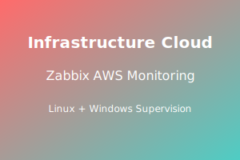

<div align="center">


# Projet : Mise en œuvre d’une infrastructure cloud de supervision centralisée sous AWS 
## Déploiement de Zabbix conteneurisé (Docker) pour le monitoring d’un parc hybride (Linux & Windows)

**Étudiant :** Marwane OUAHID  **Encadrant :** Prof. Azeddine KHIAT

**Filière :** 2ANCI - Génie Informatique  **Année universitaire :** 2025/2026



</div>

# 1. Guide étape par étape (déploiement AWS + Zabbix Docker)

Le guide opérationnel (pas à pas) est disponible ici :
- [GUIDE-AWS-ZABBIX.md](GUIDE-AWS-ZABBIX.md)

---

# 2. Introduction

## 2.1 Contexte

La supervision des systèmes est un besoin opérationnel critique pour garantir la disponibilité, la performance et la sécurité d’un SI. Dans un contexte hybride (machines Linux et Windows, potentiellement réparties entre plusieurs environnements), la centralisation du monitoring permet :
- une visibilité unifiée sur l’état des hôtes et des services ;
- l’anticipation des incidents via alertes ;
- la production de tableaux de bord (CPU, RAM, disque, réseau) exploitables.

Dans ce projet, l’objectif est de mettre en œuvre une infrastructure de supervision **centralisée dans AWS**, afin de surveiller un **parc hybride** composé :
- d’un client Linux (Ubuntu) ;
- d’un client Windows Server ;
- d’un serveur Zabbix (Docker) hébergé sur EC2.

## 2.2 Objectifs techniques

Les objectifs opérationnels et techniques sont les suivants :
1. Concevoir un réseau AWS minimal et conforme au **Learner Lab** : 1 VPC + 1 subnet public.
2. Appliquer une politique de sécurité via **Security Groups** autorisant uniquement les ports nécessaires : **80, 443, 10050, 10051, 22, 3389**.
3. Déployer Zabbix **conteneurisé** (Docker + Docker Compose) sur une instance EC2 dédiée.
4. Installer et configurer les **agents Zabbix** sur :
   - Ubuntu (client Linux) ;
   - Windows Server (client Windows).
5. Valider la supervision via :
   - ajout des hôtes dans Zabbix ;
   - statut **ZBX** au vert ;
   - métriques et graphiques CPU/RAM.

## 2.3 Technologies utilisées

| Domaine | Technologies |
|---|---|
| Cloud & Réseau | **AWS** (VPC, Subnet, Internet Gateway, Route Table, Security Groups) |
| Compute | **EC2** (t3.medium, t3.large) |
| Conteneurisation | **Docker**, **Docker Compose** |
| Supervision | **Zabbix Server**, **Zabbix Web**, **Zabbix Agent** |
| Systèmes | **Ubuntu** (serveur + client Linux), **Windows Server** (client Windows) |

---

# 3. Architecture Réseau

## 3.1 Description du VPC

L’architecture réseau retenue est volontairement **simple** afin de respecter les contraintes du Learner Lab et de faciliter l’accès (sans VPN) :
- **1 VPC**
- **1 subnet public** (les instances disposent d’une IP publique pour l’administration et l’accès web)

> Remarque : les valeurs exactes (CIDR, IDs) peuvent varier selon le Lab. Les champs ci-dessous doivent être renseignés avec les valeurs observées dans la console AWS.

## 3.2 Schéma réseau (capture)


*Figure 1 : Création du VPC*


*Figure 2 : Création du sous-réseau*


*Figure 3 : Organisation des sous-réseaux (public/privé)*

## 3.3 Paramètres réseau (CIDR, Subnet, IGW, Route Table)

### 3.3.1 CIDR et sous-réseau public

- **CIDR du VPC :** `<VPC_CIDR>` (ex. `10.0.0.0/16`)  
- **CIDR du subnet public :** `<PUBLIC_SUBNET_CIDR>` (ex. `10.0.1.0/24`)  
- **Attribution IPv4 publique :** activée sur le subnet public (afin d’obtenir des IP publiques)

### 3.3.2 Internet Gateway (IGW)

- **IGW :** associé au VPC pour permettre la connectivité Internet.
- **But :** accès SSH/RDP et accès Web Zabbix.

### 3.3.3 Route Table

- **Route par défaut :** `0.0.0.0/0 -> IGW` (pour le subnet public)
- **Association :** la Route Table est associée au subnet public.

## 3.4 Security Groups (ports autorisés)

Les Security Groups sont configurés pour autoriser strictement les flux nécessaires au projet.

### 3.4.1 Liste des ports requis

| Port | Protocole | Rôle | Sens |
|---:|---|---|---|
| 80 | TCP | Zabbix Web (HTTP) | Client → Zabbix Web |
| 443 | TCP | Zabbix Web (HTTPS) | Client → Zabbix Web |
| 10051 | TCP | Zabbix Server (trap/collector) | Agents/Serveur → Zabbix Server |
| 10050 | TCP | Zabbix Agent (écoute) | Zabbix Server → Agents |
| 22 | TCP | Administration Linux (SSH) | Admin → Instances Ubuntu |
| 3389 | TCP | Administration Windows (RDP) | Admin → Instance Windows |

### 3.4.2 Bonnes pratiques de filtrage

- Les ports d’administration **22** et **3389** doivent idéalement être restreints à **l’IP publique de l’administrateur** (et non `0.0.0.0/0`).
- Les ports **10050/10051** doivent être limités au **CIDR du VPC** ou aux **Security Groups** des instances autorisées lorsque cela est possible.


*Figure 4 : Création d'un groupe de sécurité*


*Figure 5 : Règles entrantes (ports requis)*


*Figure 6 : Règles sortantes*


*Figure 7 : Groupe de sécurité créé avec succès*

### 3.4.3 Schéma ASCII (vue logique)

```text
                 Internet
                    |
                 [ IGW ]
                    |
             +--------------+
             |   VPC (CIDR) |
             +--------------+
                    |
           +-------------------+
           | Public Subnet     |
           | (CIDR public)     |
           +-------------------+
             |       |       |
             |       |       |
     +------------+  |  +----------------+
     | EC2 Zabbix |  |  | EC2 Windows    |
     | Ubuntu     |  |  | Windows Server |
     | Web: 80/443|  |  | RDP: 3389      |
     | 10051      |  |  | Agent: 10050   |
     +------------+  |  +----------------+
            |
            |
     +----------------+
     | EC2 Linux      |
     | Ubuntu         |
     | SSH: 22        |
     | Agent: 10050   |
     +----------------+

Flux Zabbix :
- Zabbix Server -> Agents : TCP/10050
- Agents -> Zabbix Server : TCP/10051 (selon config/active checks)
```

---

# 4. Instances EC2

## 4.1 Liste des instances et caractéristiques

Le déploiement repose sur 3 instances EC2 :

| Rôle | Type EC2 | vCPU | RAM | OS | Justification |
|---|---:|---:|---:|---|---|
| **Zabbix Server** | **t3.large** | 2 | 8 GiB | Ubuntu | Nécessaire pour exécuter Docker (DB + Zabbix + Web) avec stabilité |
| **Client Linux** | **t3.medium** | 2 | 4 GiB | Ubuntu | Suffisant pour un agent Zabbix et des métriques système |
| **Client Windows** | **t3.large** | 2 | 8 GiB | Windows Server | Windows est plus gourmand, 8 GiB améliore la fluidité |

> Note : Les valeurs vCPU/RAM sont les caractéristiques standard des types t3 ; elles peuvent être confirmées dans la documentation AWS ou via la console.

## 4.2 Raisons du choix de chaque type

- **t3.large (Zabbix Server)** : évite les ralentissements lors de l’initialisation de la base de données, de l’interface Web et des services Zabbix.
- **t3.medium (Client Linux)** : dimensionnement cohérent pour un client de supervision.
- **t3.large (Client Windows)** : permet une meilleure expérience RDP et une collecte de données plus stable.

## 4.3 Systèmes d’exploitation utilisés

- Serveur Zabbix : **Ubuntu**
- Client Linux : **Ubuntu**
- Client Windows : **Windows Server**

## 4.4 Captures (création et accès)


*Figure 8 : Lancement de l'instance EC2 (serveur Zabbix)*


*Figure 9 : Création de la clé de connexion (Key Pair)*


*Figure 10 : Configuration des paramètres réseau*


*Figure 11 : Instance créée avec succès*


*Figure 12 : Connexion SSH réussie au serveur*

---

# 5. Déploiement du serveur Zabbix

Cette partie décrit le déploiement de Zabbix **conteneurisé** sur l’instance Ubuntu dédiée.

## 5.1 Installation de Docker (Ubuntu)

Procédure recommandée (Docker officiel) :

```bash
sudo apt update
sudo apt install -y ca-certificates curl gnupg

sudo install -m 0755 -d /etc/apt/keyrings
curl -fsSL https://download.docker.com/linux/ubuntu/gpg | sudo gpg --dearmor -o /etc/apt/keyrings/docker.gpg

echo "deb [arch=$(dpkg --print-architecture) signed-by=/etc/apt/keyrings/docker.gpg] https://download.docker.com/linux/ubuntu $(. /etc/os-release && echo $VERSION_CODENAME) stable" \
  | sudo tee /etc/apt/sources.list.d/docker.list > /dev/null

sudo apt update
sudo apt install -y docker-ce docker-ce-cli containerd.io docker-buildx-plugin docker-compose-plugin

sudo systemctl enable --now docker

docker --version
docker compose version
```


*Figure 13 : Installation de Docker et Docker Compose*

## 5.2 Installation de Docker Compose

Dans ce projet, Docker Compose est utilisé via le plugin officiel `docker compose` (recommandé). Aucun binaire séparé n’est nécessaire tant que `docker-compose-plugin` est installé.

## 5.3 Fichier `docker-compose.yml` (détaillé)

Le fichier de déploiement est fourni à la racine du dépôt : `docker-compose.yml`.

### 5.3.1 Contenu du fichier

```yaml
services:
  postgres:
    image: postgres:16-alpine
    container_name: zabbix-postgres
    environment:
      POSTGRES_DB: zabbix
      POSTGRES_USER: zabbix
      POSTGRES_PASSWORD: zabbixpass
    volumes:
      - pgdata:/var/lib/postgresql/data
    restart: unless-stopped

  zabbix-server:
    image: zabbix/zabbix-server-pgsql:alpine-7.0-latest
    container_name: zabbix-server
    depends_on:
      - postgres
    environment:
      DB_SERVER_HOST: postgres
      POSTGRES_DB: zabbix
      POSTGRES_USER: zabbix
      POSTGRES_PASSWORD: zabbixpass
    ports:
      - "10051:10051"
    restart: unless-stopped

  zabbix-web:
    image: zabbix/zabbix-web-nginx-pgsql:alpine-7.0-latest
    container_name: zabbix-web
    depends_on:
      - postgres
      - zabbix-server
    environment:
      DB_SERVER_HOST: postgres
      POSTGRES_DB: zabbix
      POSTGRES_USER: zabbix
      POSTGRES_PASSWORD: zabbixpass
      ZBX_SERVER_HOST: zabbix-server
      PHP_TZ: Africa/Casablanca
    ports:
      - "80:8080"
    restart: unless-stopped

volumes:
  pgdata:
```

### 5.3.2 Explication technique

- **`postgres`** : base de données persistante (volume `pgdata`).
- **`zabbix-server`** : cœur de Zabbix, écoute sur **TCP/10051** (mappé sur l’hôte).
- **`zabbix-web`** : interface Web Zabbix via Nginx, publiée en **HTTP** sur le port **80**.

### 5.3.3 Bonnes pratiques (adaptées au Lab)

- En production, ne pas stocker les mots de passe en clair : préférer des **secrets** (AWS Secrets Manager) ou un `.env` non versionné.
- Conserver `restart: unless-stopped` est utile dans le Lab pour récupérer un état sain après reboot.

## 5.4 Démarrage des conteneurs

Depuis le répertoire contenant `docker-compose.yml` :

```bash
docker compose up -d
```

Vérification :

```bash
docker ps
```


*Figure 14 : Vérification des conteneurs Docker*

## 5.5 Vérification de l'interface Web Zabbix

- Ouvrir un navigateur : `http://<IP_PUBLIQUE_ZABBIX_SERVER>/`
- Vérifier l'accès à l'interface et l'affichage du tableau de bord.


*Figure 15 : Lancement des services Zabbix via Docker*


*Figure 16 : Accès au tableau de bord Zabbix*


*Figure 17 : Vue « Hosts » (supervision des hôtes)*

---

# 6. Configuration des agents (Linux + Windows)

## 6.1 Agent Zabbix — Client Linux (Ubuntu)

### 6.1.1 Installation

```bash
sudo apt update
sudo apt install -y zabbix-agent
```

### 6.1.2 Configuration (`/etc/zabbix/zabbix_agentd.conf`)

Paramètres essentiels à vérifier/modifier :
- `Server` : IP du serveur Zabbix autorisé à interroger l’agent (checks passifs) ;
- `ServerActive` : IP du serveur Zabbix pour les checks actifs (si activés) ;
- `Hostname` : doit correspondre au nom déclaré dans l’interface Zabbix.

Extrait lisible (exemple) :

```conf
### Zabbix Agent configuration (extrait)
Server=<IP_PRIVEE_ZABBIX_SERVER>
ServerActive=<IP_PRIVEE_ZABBIX_SERVER>
Hostname=client-linux
ListenPort=10050
```

Application rapide (exemple via `sed`) :

```bash
sudo sed -i 's/^Server=.*/Server=<IP_PRIVEE_ZABBIX_SERVER>/' /etc/zabbix/zabbix_agentd.conf
sudo sed -i 's/^ServerActive=.*/ServerActive=<IP_PRIVEE_ZABBIX_SERVER>/' /etc/zabbix/zabbix_agentd.conf
sudo sed -i 's/^Hostname=.*/Hostname=client-linux/' /etc/zabbix/zabbix_agentd.conf
```

### 6.1.3 Démarrage et activation du service

```bash
sudo systemctl enable --now zabbix-agent
sudo systemctl status zabbix-agent
```


*Figure 18 : Lancement de l'instance EC2 (client Linux)*


*Figure 19 : Configuration « server / client / agent »*


*Figure 20 : Activation du service agent côté client Linux*


*Figure 21 : Modification/validation des paramètres de l’hôte Linux*

## 6.2 Agent Zabbix — Client Windows (Windows Server)

### 6.2.1 Installation (MSI)

- Télécharger l’agent Zabbix (version compatible avec votre serveur Zabbix).
- Lancer l’installateur MSI.
- Renseigner/valider :
  - **Server** : `<IP_PRIVEE_ZABBIX_SERVER>`
  - **Hostname** : `client-windows` (ou un nom cohérent avec Zabbix)


*Figure 22 : Lancement de l'instance EC2 (client Windows)*


*Figure 23 : Affichage et accès au client Windows*


*Figure 24 : Installation de l’agent Zabbix sur Windows*

### 6.2.2 Configuration (Hostname et Server)

Sur Windows, le fichier est généralement situé dans un chemin du type :
- `C:\Program Files\Zabbix Agent\zabbix_agentd.conf`

Extrait recommandé :

```conf
### Zabbix Agent configuration (extrait)
Server=<IP_PRIVEE_ZABBIX_SERVER>
ServerActive=<IP_PRIVEE_ZABBIX_SERVER>
Hostname=client-windows
ListenPort=10050
```

### 6.2.3 Pare-feu Windows

Vérifier que le pare-feu autorise l’entrée sur **TCP/10050** (depuis le serveur Zabbix ou le CIDR du VPC), sinon l’hôte restera en statut dégradé.


*Figure 25 : Paramétrage de l’hôte Windows dans Zabbix*

---

# 7. Monitoring et Tableaux de Bord

## 7.1 Ajout des hôtes dans Zabbix

Procédure (interface Zabbix) :
1. Aller dans **Configuration → Hosts**.
2. Cliquer **Create host**.
3. Définir :
   - **Host name** : `client-linux` / `client-windows`
   - **Interfaces** : Agent (IP privée de l’instance, port 10050)
   - **Templates** : associer un template système (Linux by Zabbix agent / Windows by Zabbix agent, selon la version)
4. Sauvegarder.

## 7.2 Statut « ZBX » en vert

Le statut **ZBX** vert valide la connectivité agent et la collecte des métriques.


*Figure 26 : Ajout des hôtes réussi*


*Figure 27 : Liste des hôtes (statut de connexion)*

## 7.3 Graphiques CPU/RAM et données temps réel

- **Monitoring → Latest data** : contrôle des métriques reçues.
- **Monitoring → Graphs** : visualisation des tendances et pointes (CPU/RAM/Network).


*Figure 28 : « Latest data » pour le client Linux*


*Figure 29 : « Latest data » pour le client Windows*


*Figure 30 : Graphiques de supervision (CPU/RAM, etc.)*

---

*Figure 30 : Graphiques de supervision (CPU/RAM, etc.)*

---

# 8. Difficultés rencontrées et solutions

## 8.1 Ports bloqués (10050/10051)

**Symptômes typiques :**
- ZBX reste gris/rouge ;
- données absentes dans « Latest data ».

**Causes probables :**
- règles Security Group incomplètes ;
- firewall local (UFW Linux, Windows Firewall) ;
- mauvaise IP renseignée dans `Server` / `ServerActive`.

**Solutions appliquées :**
- Vérifier les règles entrantes : **TCP/10050** (agents) et **TCP/10051** (serveur).
- Restreindre au besoin, mais s’assurer que le flux est autorisé entre instances.
- Confirmer la connectivité (depuis Zabbix Server) :

```bash
# Exemple : test TCP vers l’agent Linux
nc -vz <IP_CLIENT_LINUX> 10050
```

## 8.2 Docker non démarré après arrêt du Lab

**Contexte Learner Lab :** le Lab peut s’arrêter automatiquement. Après redémarrage de l’instance, il est possible que les services ne soient pas immédiatement disponibles.

**Solutions appliquées :**
- Activer Docker au boot :

```bash
sudo systemctl enable --now docker
```

- Relancer le stack Zabbix :

```bash
docker compose up -d
```

- Les conteneurs sont configurés avec `restart: unless-stopped` pour améliorer la résilience après reboot.

## 8.3 Limitations du Learner Lab (région, arrêt des instances, budget)

Contraintes critiques à respecter :
- **Région** : utiliser **us-east-1 (N. Virginia)**.
- **Types d’instances** : rester sur **t3.medium** et **t3.large** (les grosses tailles peuvent être bloquées).
- **Arrêt automatique** : penser à redémarrer Docker/Compose après reprise.
- **Budget** : enveloppe limitée (ex. **50$**). Il faut **Stop** les instances hors utilisation.

---

# 9. Conclusion

## 9.1 Résumé des acquis

Ce projet a permis de :
- concevoir une architecture réseau AWS minimaliste (VPC + subnet public) adaptée à un Lab ;
- déployer un serveur de supervision moderne via **Docker Compose** (approche reproductible) ;
- intégrer deux environnements distincts (Linux + Windows) via des agents Zabbix ;
- valider la collecte de métriques et la visualisation via « Latest data » et « Graphs ».

## 9.2 Importance d’un monitoring hybride

Dans un contexte réel, les SI sont rarement homogènes. La supervision hybride apporte :
- une visibilité transverse (Windows + Linux) ;
- une meilleure capacité de diagnostic ;
- des alertes unifiées sur l’ensemble du parc.

## 9.3 Améliorations futures possibles

- Sécurisation : accès privé (VPN/Bastion), réduction des ports exposés publiquement.
- Automatisation : Infrastructure as Code (Terraform/CloudFormation).
- Haute disponibilité : multi-AZ, base de données managée, sauvegardes et restauration.

---

# 10. Lien GitHub

Dépôt GitHub :
- https://github.com/MarwaneOUAHID/zabbix-docker-aws-monitoring
